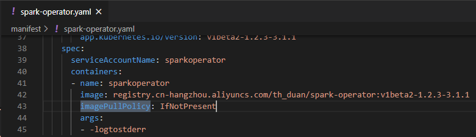
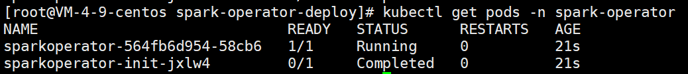
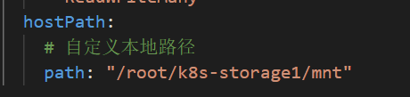
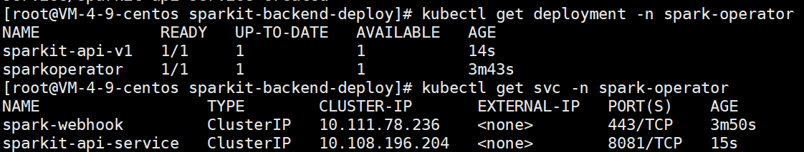
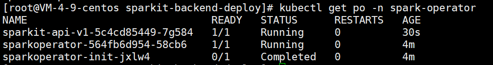
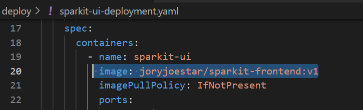
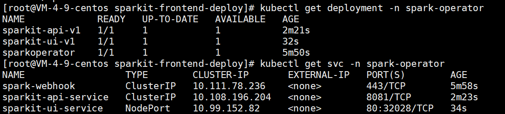
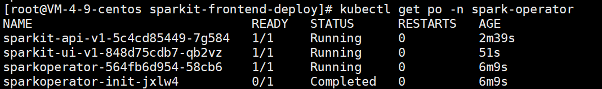
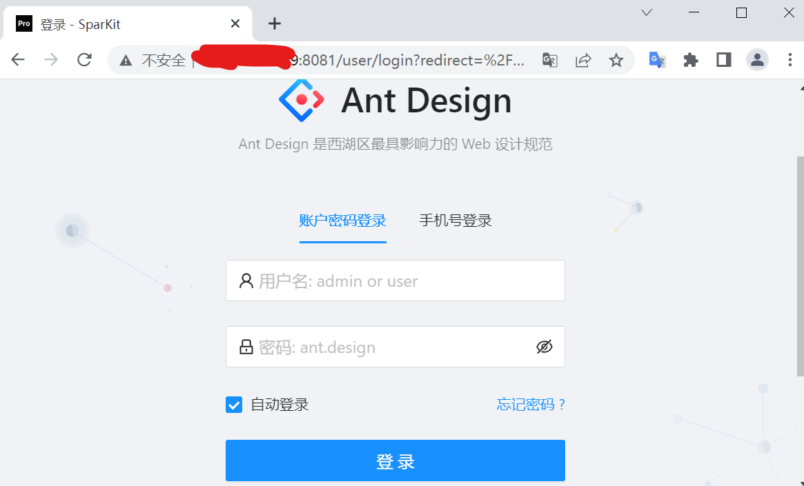
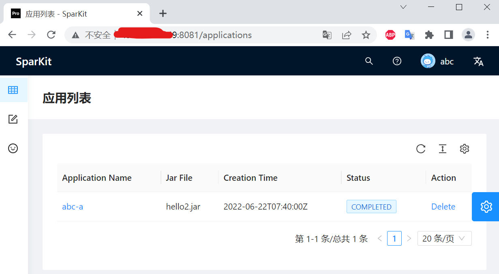

# SparKit不完全指南

## 部署手册

### 准备工作

#### 部署环境

Kubernetes (Version >= 1.16)

#### 部署顺序

本平台包含 前端 - 后端 - Operator 三层应用，依次按照Operator、后端、前端的顺序在Kubernetes中进行部署。

  

#### 镜像准备

建议在部署平台之前，提前将所有镜像下载到集群的所有节点中。镜像通过docker pull命令进行下载，所需的镜像列表如下：

| 镜像                                         | 说明                                                |
| -------------------------------------------- | --------------------------------------------------- |
| gcr.io/spark-operator:v1beta2-1.2.3-3.1.1    | Spark Operator镜像                                  |
| gcr.io/spark:v3.1.1                          | Spark on K8s镜像                                    |
| joryjoestar/sparkit-backend:v1               | API接口服务镜像                                     |
| joryjoestar/sparkit-frontend:v1              | 前端服务镜像                                        |
| joryjoestar/sparkit-frontend:v1-with-ingress | 前端服务镜像，需要部署ingress，在部署CS-Cloud时使用 |

镜像来源有两种，可以使用现有仓库中的镜像（Docker hub），也可以从项目构建、推送到自己的仓库中。

##### (1) 从镜像仓库拉取

从Docker hub拉取 (docker.io)

```shell
docker pull joryjoestar/spark-operator:v1beta2-1.2.3-3.1.1
docker pull joryjoestar/spark:v3.1.1
docker pull joryjoestar/sparkit-backend:v1
docker pull joryjoestar/sparkit-frontend:v1
```

拉取成功后将spark-operator和spark镜像打上tag

```
docker tag joryjoestar/spark-operator:v1beta2-1.2.3-3.1.1 gcr.io/spark-operator/spark-operator:v1beta2-1.2.3-3.1.1
docker tag joryjoestar/spark:v3.1.1 gcr.io/spark-operator/spark:v3.1.1
```

##### (2) 从项目构建镜像

也可以选择直接从前端和后端项目直接构建镜像。两个项目都编写了Dockerfile，并在此基础上编写了Makefile，使用make命令可以一键构建。

构建后端镜像只需Docker环境即可。

构建前端镜像需要Node.js开发环境和Docker环境。

构建完之后的镜像记得打上tag！！

#### Yaml文件

所有应用使用yaml文件部署，前端和后端的yaml文件在项目的deploy目录下，Operator的yaml文件在项目的manifest目录下。本文档项目下的deploy文件包含了前端-后端-Operator三层服务的所有部署文件，按照以下指导部署即可。

### 部署Spark on k8s operator

#### 部署

使用本项目中的`deploy/spark-operator-deploy`目录下的文件进行部署，将所有文件上传至Kubernetes集群或可以使用kubectl的客户端，依次使用以下命令进行部署。

```shell
## 部署crd
kubectl apply -f crds
## 部署operator的服务账号与授权策略
kubectl apply -f spark-operator-rbac.yaml 
## 部署spark集群的服务账号与授权策略
kubectl apply -f spark-rbac.yaml 
## 部署带webhook功能的spark-on-k8s-operator
kubectl apply -f spark-operator-with-webhook.yaml
```

部署文件来源于spark-on-k8s-operator项目的manifest目录(https://github.com/Jory-Joestar/spark-on-k8s-operator)

在原来的基础上修改了镜像拉取策略imagePullPolicy，将Always改为IfNotPresent，避免每次安装都拉一次镜像

  

#### 验证

```sh
# 查看是否有namespace spark-operator
kubectl get namespaces
# 查看operator pod是否正常运行
kubectl get pods --namespace spark-operator
```

  

### 部署API层

#### 部署

部署文件位于本项目`deploy/sparkit-backend-deploy`目录下

首先部署持久卷，如果Kubernetes配置了nfs，可以部署基于nfs的持久卷。注意在pv-volume-nfs.yaml文件中指定nfs服务器ip和路径

  

```sh
# 如果使用nfs作为持久卷
kubectl apply -f pv-volume-nfs.yaml  #注意修改路径
kubectl apply -f pv-claim-nfs.yaml
```

如果没有配置nfs，则使用master的hostpath作为持久卷。需要在pv-volume.yaml文件中指定hostpath在宿主机上挂载的路径。

 

```sh
# 基于hostpath的持久卷
kubectl apply -f pv-volume.yaml  #注意修改路径
kubectl apply -f pv-claim.yaml
```

随后部署后端服务即可
```sh
kubectl apply -f sparkit-api-rbac.yaml
kubectl apply -f sparkit-api-deployment.yaml
kubectl apply -f sparkit-api-service.yaml
```

#### 验证

```sh
kubectl get deployment -n spark-operator
kubectl get svc -n spark-operator
```

  

  

### 部署UI层

#### 部署

部署文件位于本项目`deploy/sparkit-frontend-deploy`目录下

注意，如果部署在CS-Cloud上，前端服务通过ingress访问，则需要修改`sparkit-ui-deployment.yaml`中的镜像为`joryjoestar/sparkit-frontend:v1-with-ingress`，还需部署`sparkit-ui-ingress.yaml`

  

```sh
# cd /root/spark-operator-deploy/sparkit-ui
kubectl apply -f sparkit-ui-deployment.yaml #如部署在CS-Cloud，使用Ingress，则修改镜像
kubectl apply -f sparkit-ui-service.yaml
#如部署在CS-Cloud，则部署Ingress
kubectl apply -f sparkit-ui-ingress.yaml
```

#### 验证

```sh
kubectl get deployment -n spark-operator
kubectl get svc -n spark-operator
```

  

  

使用port-forward，通过宿主机的8081端口访问service，前端正常渲染，能正常提交spark任务，代表部署完成。

```
kubectl port-forward --address 0.0.0.0 service/sparkit-ui-service 8081:80 -n spark-operator
```

  

  


## 开发手册

